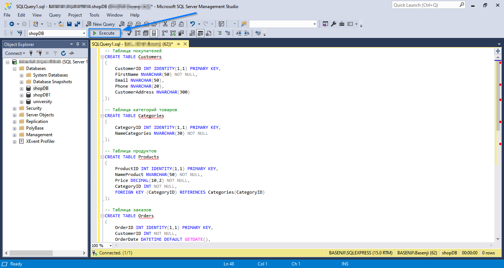

## Задача
Освоить работу со стеком технологий:

* C#
* MSSQL
* Blazor Server App

На примере создания простейшего проекта - онлайн-магазин **blazorShop**.
P.S. Предполагается, что установлены C#, Visual Studio 2022 и Microsoft SQL Server.

## Этапы решения задачи

* Создание базы данных
* Создание проекта **blazorShop**, состоящего из двух подпроектов: **adminShop** и **shop**
* Подключение к базе данных
* Создание классов моделей и сущности на основе существующей базы данных
* Работа с подпроектом **adminShop**.


### Создание базы данных
Запускаем Microsoft SQL Server Management Studio 18.
Через окно логина входим со своим именем и паролем, заранее заданными во время установки Microsoft SQL Server.

В окне ***Object Explorer*** разворачиваем Databases и щелкаем по нему правой кнопкой мыши и в контекстном меню выбираем **New Database...**

В появившемся окне задаем имя будущей базе данных, например - shopDB. Остальное оставляем по умолчанию.

После чего появится в окне обозревателя баз данных новая база данных с именем shopDB.


По этой базе данных снова щелкаем правой кнопкой мыши, в контекстном меню выбираем **New Query**.

И пишем код создания следующих таблиц:

```
-- Таблица покупателей
CREATE TABLE Customers
(
    CustomerID INT IDENTITY(1,1) PRIMARY KEY,
    FirstName NVARCHAR(50) NOT NULL,
    Email NVARCHAR(50),
    Phone NVARCHAR(20),
    CustomerAddress NVARCHAR(300)
);

-- Таблица категорий товаров 
CREATE TABLE Categories 
(
    CategoryID INT IDENTITY(1,1) PRIMARY KEY,
    NameCategories NVARCHAR(30) NOT NULL
);

-- Таблица продуктов
CREATE TABLE Products 
(
    ProductID INT IDENTITY(1,1) PRIMARY KEY,
    NameProduct NVARCHAR(50) NOT NULL,
    Price DECIMAL(10,2) NOT NULL,
    CategoryID INT NOT NULL,
    FOREIGN KEY (CategoryID) REFERENCES Categories(CategoryID)
);

-- Таблица заказов
CREATE TABLE Orders 
(
    OrderID INT IDENTITY(1,1) PRIMARY KEY,
    CustomerID INT NOT NULL,
    OrderDate DATETIME DEFAULT GETDATE(),
    DeliveryAddress NVARCHAR(300), -- может быть NULL, если доставка не нужна
    FOREIGN KEY (CustomerID) REFERENCES Customers(CustomerID)
);

-- Состав заказа
CREATE TABLE OrderItems
(
    OrderItemID INT IDENTITY(1,1) PRIMARY KEY,
    OrderID INT NOT NULL,
    ProductID INT NOT NULL,
    Quantity INT NOT NULL,
    FOREIGN KEY (OrderID) REFERENCES Orders(OrderID),
    FOREIGN KEY (ProductID) REFERENCES Products(ProductID)
);

```
После чего щелкаем по Execute c зеленым треугольником



После чего SQL Server создаст пять таблиц.


И для убедительности создаем диаграмму, чтобы увидеть, верно ли связаны между собой таблицы, щелкнув по **Database Diagrams** правой кнопкой мыши и выбрав в контекстном меню **New Database Diagram**. Подтверждаем намерение создать диаграмму. В появившемся окне выбираем все таблицы, после чего щелкаем по кнопке **Add**.


В результате создастся диаграмма связей между таблицами:


Вот и все.
